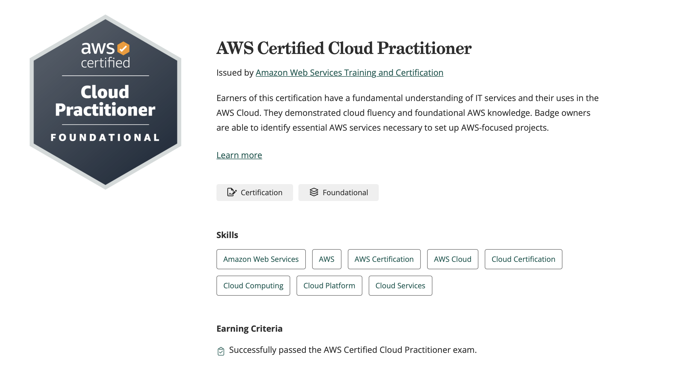
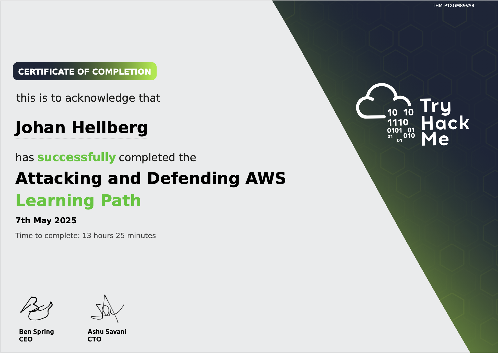
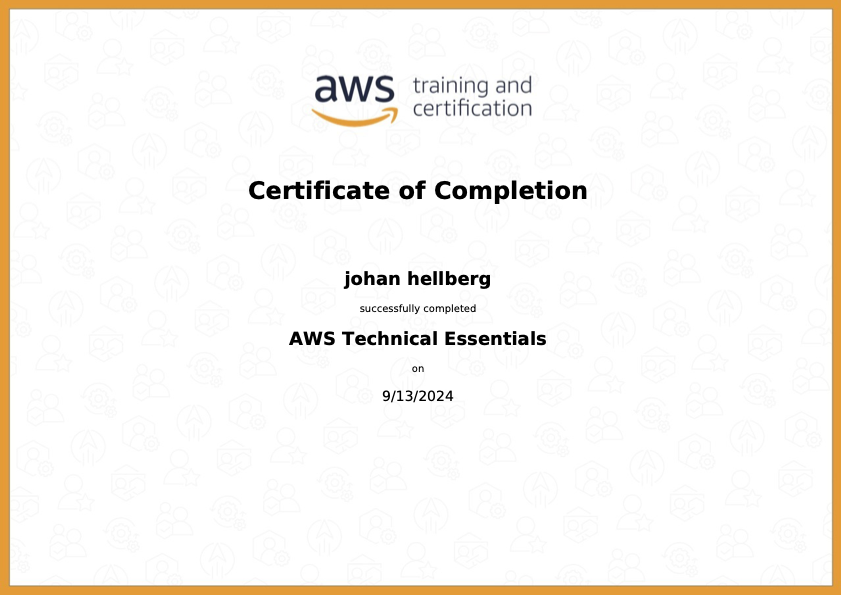
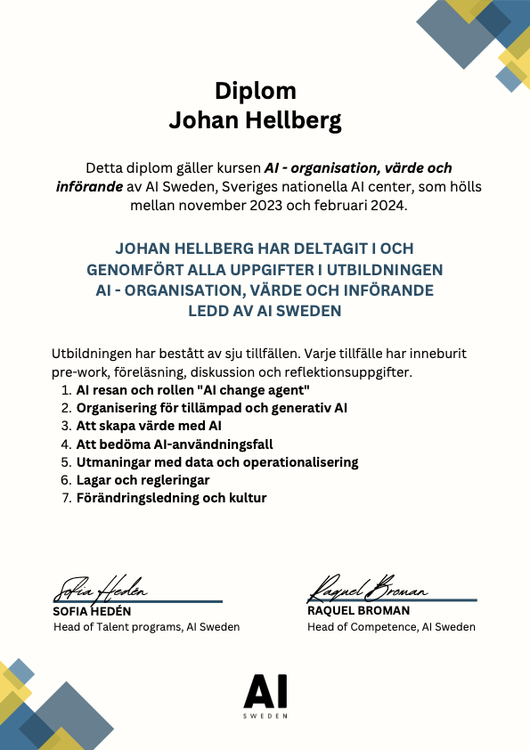
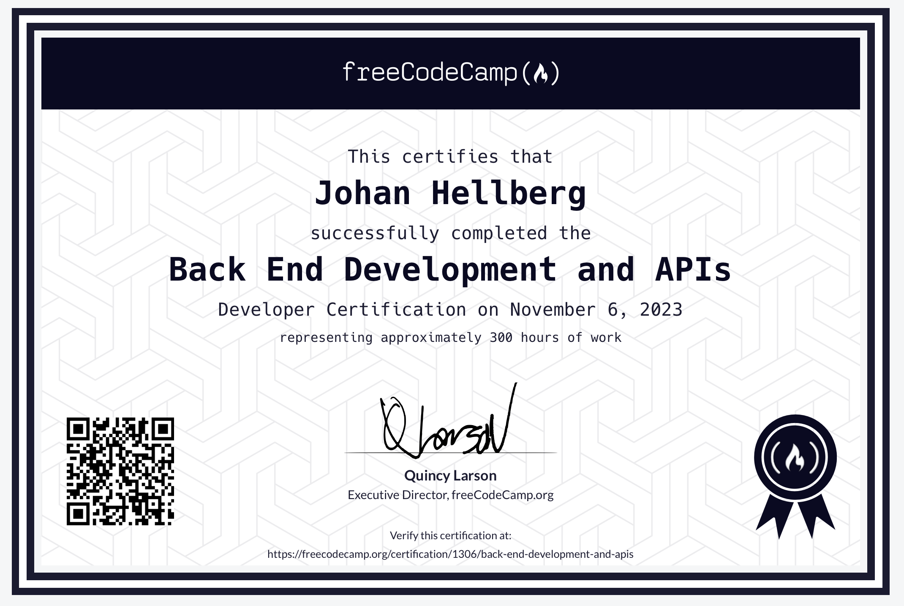

# My collection of certificates

## AWS Technical Essentials

> "johan hellberg AWS Certified Cloud Practitioner"

## AWS Technical Essentials

> "johan hellberg successfully completed Attacking and Defending AWS"

## AWS Technical Essentials

> "johan hellberg successfully completed AWS Technical Essentials"

## AI - organization, value, and implementation of AI Sweden.

> "This certifies that Johan Hellberg has successfully completed AI - organization, value, and implementation of AI Sweden."

## Foundational C# with Microsoft Certificate.

> "This certifies that Johan Hellberg has successfully completed the Foundational C# with Microsoft Certificate through freeCodeCamp.org."

[Link to Certificate](https://www.freecodecamp.org/certification/1306/foundational-c-sharp-with-microsoft "Link to Foundational C# with Microsoft Certificate")

## Back End Development and APIs Certificate.

> "This certifies that Johan Hellberg has successfully completed the freeCodeCamp.org Back End Development and APIs Developer Certification, representing approximately 300 hours of work."

[Link to Certificate](https://www.freecodecamp.org/certification/1306/back-end-development-and-apis "Back End Development and APIs Certificate")

## Algorithms and Data Structures Certificate.

> "This certifies that Johan Hellberg has successfully completed the freeCodeCamp.org Algorithms and Data Structures Certification, representing approximately 300 hours of work."

[Link to Certificate](https://www.freecodecamp.org/certification/1306/javascript-algorithms-and-data-structures "Algorithms and Data Structures Certificate")

## Responsive Web Design Certificate.

> "This certifies that Johan Hellberg has successfully completed the freeCodeCamp.org Responsive Web Design Developer Certification, representing approximately 300 hours of work."

[Link to Certificate](https://www.freecodecamp.org/certification/1306/responsive-web-design "Link to Responsive Web Design Certificate")

## Certificate of graduation for Vue 3 with TypeScript.

### In progress
- Frontend Libraries Development
- Foundational C# with Microsoft
