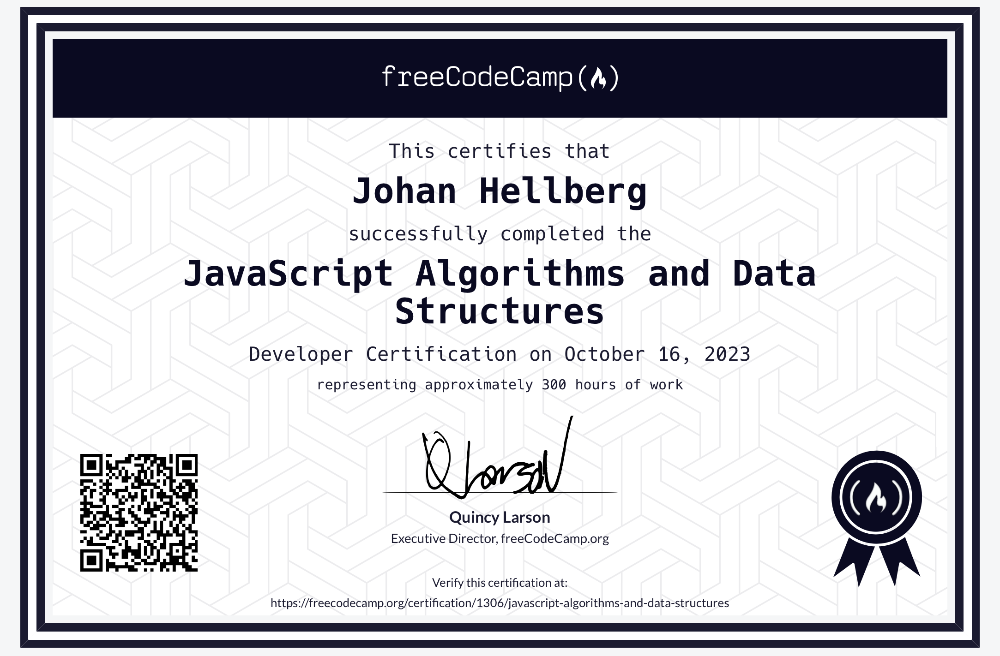
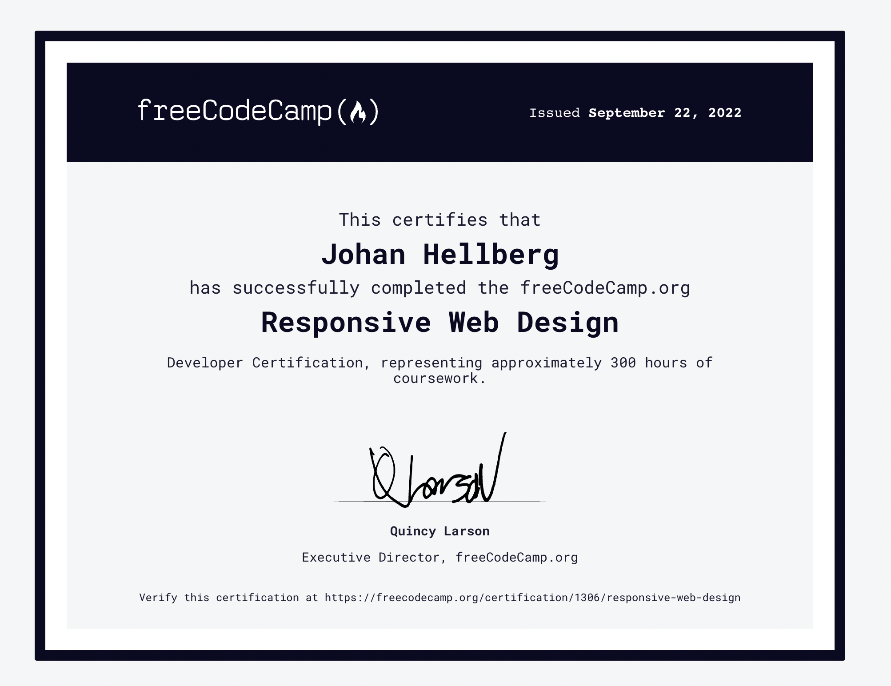
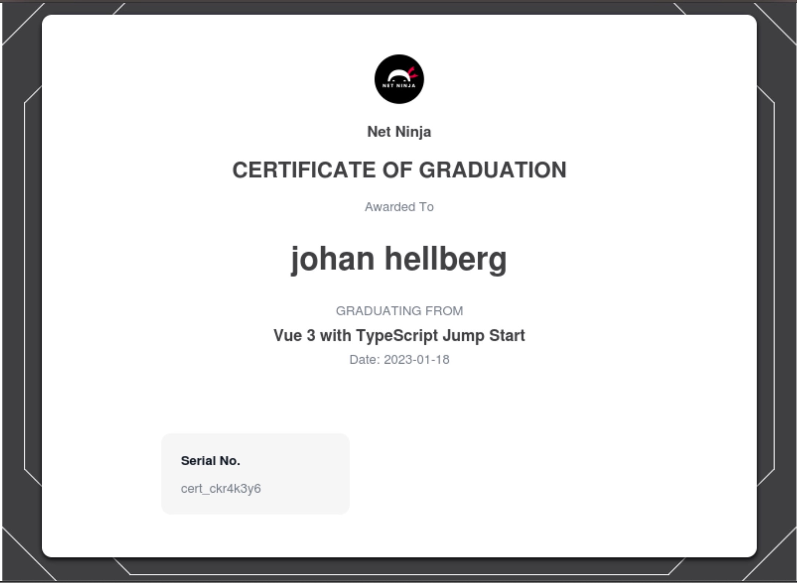

# My collection of certificates

## Algorithms and Data Structures Certificate.
[Link to Certificate](https://www.freecodecamp.org/certification/1306/javascript-algorithms-and-data-structures "Algorithms and Data Structures Certificate")

> "This certifies that Johan Hellberg has successfully completed the freeCodeCamp.org Algorithms and Data Structures Certification, representing approximately 300 hours of coursework"

## Responsive Web Design Certificate.
[Link to Certificate](https://www.freecodecamp.org/certification/1306/responsive-web-design "Link to Responsive Web Design Certificate")

> "This certifies that Johan Hellberg has successfully completed the freeCodeCamp.org Responsive Web Design Developer Certification, representing approximately 300 hours of coursework"

## Certificate of graduation for Vue 3 with TypeScript.

### In progress
- Frontend Libraries Development
- Back End Development and APIs
- Foundational C# with Microsoft
